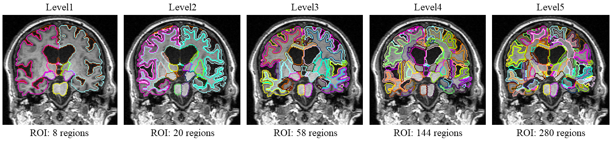

# OpenMAP-T1


[](https://www.medrxiv.org/content/10.1101/2024.01.18.24301494v1)
[](https://onlinelibrary.wiley.com/journal/10970193)
[](https://colab.research.google.com/drive/1fmfkxxZjChExnl5cHITYkNYgTu3MZ7Ql#scrollTo=xwZxyL5ewVNF)


**OpenMAP-T1: A Rapid Deep-Learning Approach to Parcellate 280 Anatomical Regions to Cover the Whole Brain**<br>
**Author**: Kei Nishimaki, [Kengo Onda](https://researchmap.jp/kengoonda?lang=en), Kumpei Ikuta, Jill Chotiyanonta, [Yuto Uchida](https://researchmap.jp/uchidayuto), [Susumu Mori](https://www.hopkinsmedicine.org/profiles/details/susumu-mori), [Hitoshi Iyatomi](https://iyatomi-lab.info/english-top), [Kenichi Oishi](https://www.hopkinsmedicine.org/profiles/details/kenichi-oishi)<br>

The Russell H. Morgan Department of Radiology and Radiological Science, The Johns Hopkins University School of Medicine, Baltimore, MD, USA <br>
Department of Applied Informatics, Graduate School of Science and Engineering, Hosei University, Tokyo, Japan <br>
The Richman Family Precision Medicine Center of Excellence in Alzheimer's Disease, Johns Hopkins University School of Medicine, Baltimore, MD, USA<br>

**Abstract**: *This study introduces OpenMAP-T1, a deep learning-based method for rapid and accurate whole brain parcellation in T1-weighted brain MRI, aiming to overcome the limitations of conventional normalization-to-atlas-based approaches and multi-atlas label-fusion (MALF) techniques. Brain image parcellation is a fundamental process in neuroscientific and clinical research, enabling detailed analysis of specific cerebral regions. Normalization-to-atlas-based methods have been employed for this task, but they face limitations due to variations in brain morphology, especially in pathological conditions. The MALF teqhniques improved the accuracy of the image parcellation and robustness to variations in brain morphology but at the cost of high computational demand that requires lengthy processing time. OpenMAP-T1 integrates several convolutional neural network models across six phases: preprocessing, cropping, skull stripping, parcellation, hemisphere segmentation, and final merging. This process involves standardizing MRI images, isolating the brain tissue, and parcellating it into 280 anatomical structures that cover the whole brain, including detailed gray and white matter structures, while simplifying the parcellation processes and incorporating robust training to handle various scan types and conditions. The OpenMAP-T1 was tested on eight available open resources, including real-world clinical images, demonstrating robustness across different datasets with variations in scanner types, magnetic field strengths, and image processing techniques like defacing. Compared to existing methods, OpenMAP-T1 significantly reduced the processing time per image from several hours to less than 90 seconds without compromising accuracy. It was particularly effective in handling images with intensity inhomogeneity and varying head positions, conditions commonly seen in clinical settings. The adaptability of OpenMAP-T1 to a wide range of MRI datasets and robustness to various scan conditions highlight its potential as a versatile tool in neuroimaging.*

Paper: https://www.medrxiv.org/content/10.1101/2024.01.18.24301494v1<br>
Submitted for publication in the **Not yet**<br>

## Version
| Version | Release Date  | Link                                               | Speed       |
|---------|---------------|----------------------------------------------------|-------------|
| 2.0.0   | January  2024 | https://github.com/OishiLab/OpenMAP-T1/tree/v2.0.0 | 50 sec/case |
| 1.0.0   | December 2023 | https://github.com/OishiLab/OpenMAP-T1/tree/v1.0.0 | 90 sec/case |

## Supplementary information

The OpenMAP-T1 parcellate the entire brain into five hierarchical structural levels, with the coarsest level comprising eight structures and the finest level comprising 280 structures. Changing these levels is easy using [ROIEditor](https://www.mristudio.org/installation.html).


## Citation
```
@article{nishimaki2024openmap,
  title={OpenMAP-T1: A Rapid Deep Learning Approach to Parcellate 280 Anatomical Regions to Cover the Whole Brain},
  author={Nishimaki, Kei and Onda, Kengo and Ikuta, Kunpei and Uchida, Yuto and Mori, Susumu and Iyatomi, Hitoshi and Oishi, Kenichi},
  journal={medRxiv},
  pages={2024--01},
  year={2024},
  publisher={Cold Spring Harbor Laboratory Press}
}
```
