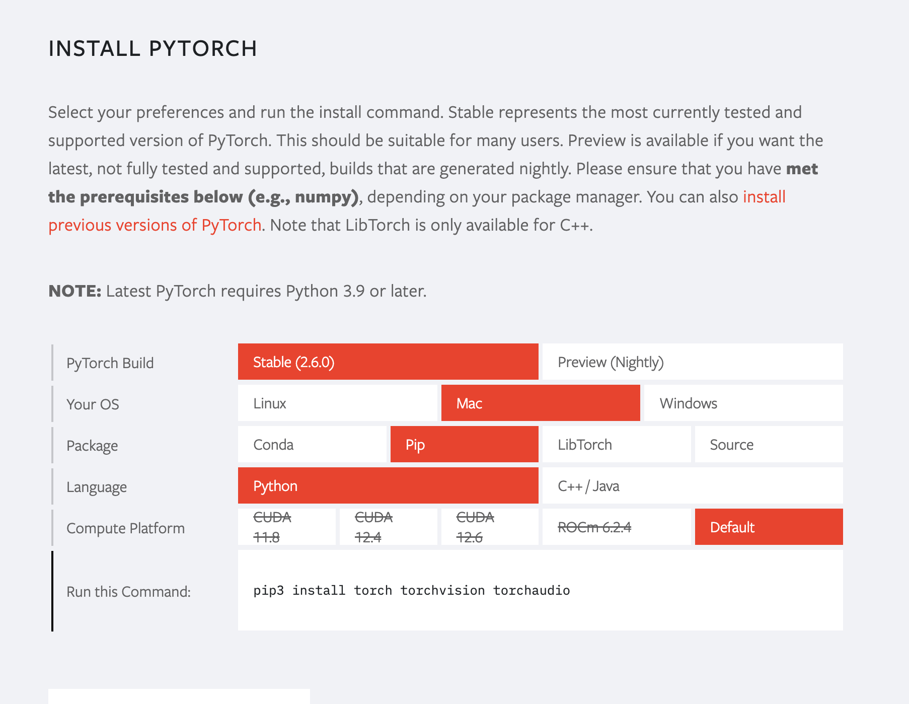

# OpenMAP-T1-V2 plus QC and Refacing
**OpenMAP-T1-V2 parcellates the whole brain into 280 anatomical regions based on JHU-atlas in 50 (sec/case).**
**The entire process takes 210 (sec/case).**

[](https://colab.research.google.com/drive/1fmfkxxZjChExnl5cHITYkNYgTu3MZ7Ql#scrollTo=xwZxyL5ewVNF)

## Installation Instructions
0. install python and make virtual environment<br>
python3.9 or later is recommended.

1. Clone this repository, and go into the repository:
```
git clone -b v2.0.0 https://github.com/OishiLab/OpenMAP-T1.git
cd OpenMAP-T1
```
2. Please install PyTorch compatible with your environment.<br>
https://pytorch.org/

Once you select your environment, the required commands will be displayed.



If you want to install an older Pytorch environment, you can download it from the link below.<br>
https://pytorch.org/get-started/previous-versions/

4.  Install libraries other than PyTorch:
```
pip install -r requirements.txt
```
5. Please apply and download the pre-trained model from the link below and upload it to your server.

6. You can run OpenMAP-T1 !!

## How to use it
Using OpenMAP-T1 is straightforward. You can use it in any terminal on your linux system. We provide CPU as well as GPU support. Running on GPU is a lot faster though and should always be preferred. Here is a minimalistic example of how you can use OpenMAP-T1.
```
python3 parcellation.py -i INPUT_FOLDER -o OUTPUT_FOLDER -m MODEL_FOLDER
```
If you want to specify the GPU, please add ```CUDA_VISIBLE_DEVICES=N```.
```
CUDA_VISIBLE_DEVICES=1 python3 parcellation.py -i INPUT_FOLDER -o OUTPUT_FOLDER -m MODEL_FOLDER
```

## How to download the pretrained model.
You can get the pretrained model from the this link.
[Link of pretrained model](https://forms.office.com/Pages/ResponsePage.aspx?id=OPSkn-axO0eAP4b4rt8N7Iz6VabmlEBIhG4j3FiMk75UQUxBMkVPTzlIQTQ1UEZJSFY1NURDNzRERC4u)


## Folder
All images you input must be in NifTi format and have a .nii extension.
```
INPUR_FOLDER/
  ├ A.nii
  ├ B.nii
  ├ *.nii

OUTPUT_FOLDER/
  ├ A/
  |   ├ A.nii # refaced input image
  |   ├ A_level1volume.csv # level1 volume information (mm^3)
  |   ├ A_level2volume.csv # level2 volume information (mm^3)
  |   ├ A_level3volume.csv # level3 volume information (mm^3)
  |   ├ A_level4volume.csv # level4 volume information (mm^3)
  |   ├ A_level5volume.csv # level5 volume information (mm^3)
  |   ├ A_qc.csv # quality control
  |   └ A_280.nii # parcellation map
  └ B/
      ├ B.nii
      ├ B_level1volume.csv
      ├ B_level2volume.csv
      ├ B_level3volume.csv
      ├ B_level4volume.csv
      ├ B_level5volume.csv
      ├ B_qc.csv
      └ B_280.nii

MODEL_FOLDER/
  ├ CNet/CNet.pth
  ├ SSNet/SSNet.pth
  ├ PNet
  |   ├ coronal.pth
  |   ├ sagittal.pth
  |   └ axial.pth
  └ HNet/
      ├ coronal.pth
      └ axial.pth
```

## FAQ
* **How much GPU memory do I need to run OpenMAP-T1?** <br>
We ran all our experiments on NVIDIA RTX3090 GPUs with 24 GB memory. For inference you will need less, but since inference in implemented by exploiting the fully convolutional nature of CNNs the amount of memory required depends on your image. Typical image should run with less than 4 GB of GPU memory consumption. If you run into out of memory problems please check the following: 1) Make sure the voxel spacing of your data is correct and 2) Ensure your MRI image only contains the head region.

* **Will you provide the training code as well?** <br>
No. The training code is tightly wound around the data which we cannot make public.
