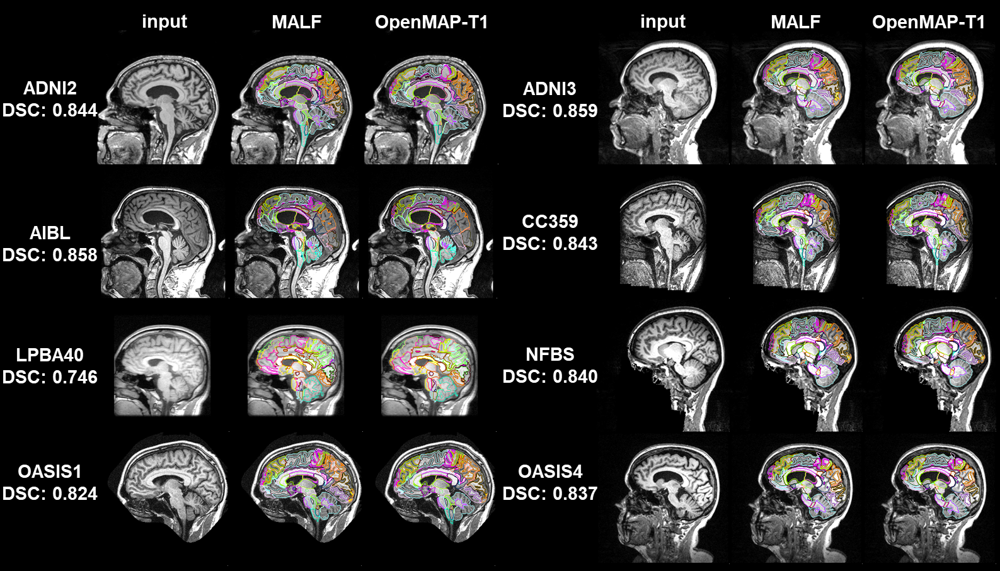

# OpenMAP-T1


**Languages**: [English](README.md) | [日本語 (Japanese)](docs/README-ja.md)

[](https://www.medrxiv.org/content/10.1101/2024.01.18.24301494v1)
[](https://onlinelibrary.wiley.com/journal/10970193)
[](https://colab.research.google.com/drive/1fmfkxxZjChExnl5cHITYkNYgTu3MZ7Ql#scrollTo=xwZxyL5ewVNF)

[](https://huggingface.co/spaces/OishiLab/OpenMAP-T1)

**OpenMAP-T1: A Rapid Deep-Learning Approach to Parcellate 280 Anatomical Regions to Cover the Whole Brain**<br>
**Author**: [Kei Nishimaki](https://researchmap.jp/knishimaki?lang=en), [Kengo Onda](https://researchmap.jp/kengoonda?lang=en), [Kumpei Ikuta](https://scholar.google.com/citations?user=Q9h-OP8AAAAJ&hl=ja), [Jill Chotiyanonta](https://www.researchgate.net/profile/Jill-Chotiyanonta), [Yuto Uchida](https://researchmap.jp/uchidayuto), [Susumu Mori](https://www.hopkinsmedicine.org/profiles/details/susumu-mori), [Hitoshi Iyatomi](https://iyatomi-lab.info/english-top), [Kenichi Oishi](https://www.hopkinsmedicine.org/profiles/details/kenichi-oishi)<br>

The Russell H. Morgan Department of Radiology and Radiological Science, The Johns Hopkins University School of Medicine, Baltimore, MD, USA <br>
Department of Applied Informatics, Graduate School of Science and Engineering, Hosei University, Tokyo, Japan <br>
The Richman Family Precision Medicine Center of Excellence in Alzheimer's Disease, Johns Hopkins University School of Medicine, Baltimore, MD, USA<br>

**Abstract**: *This study introduces OpenMAP-T1, a deep learning-based method for rapid and accurate whole brain parcellation in T1-weighted brain MRI, aiming to overcome the limitations of conventional normalization-to-atlas-based approaches and multi-atlas label-fusion (MALF) techniques. Brain image parcellation is a fundamental process in neuroscientific and clinical research, enabling detailed analysis of specific cerebral regions. Normalization-to-atlas-based methods have been employed for this task, but they face limitations due to variations in brain morphology, especially in pathological conditions. The MALF teqhniques improved the accuracy of the image parcellation and robustness to variations in brain morphology but at the cost of high computational demand that requires lengthy processing time. OpenMAP-T1 integrates several convolutional neural network models across six phases: preprocessing, cropping, skull stripping, parcellation, hemisphere segmentation, and final merging. This process involves standardizing MRI images, isolating the brain tissue, and parcellating it into 280 anatomical structures that cover the whole brain, including detailed gray and white matter structures, while simplifying the parcellation processes and incorporating robust training to handle various scan types and conditions. The OpenMAP-T1 was tested on eight available open resources, including real-world clinical images, demonstrating robustness across different datasets with variations in scanner types, magnetic field strengths, and image processing techniques like defacing. Compared to existing methods, OpenMAP-T1 significantly reduced the processing time per image from several hours to less than 90 seconds without compromising accuracy. It was particularly effective in handling images with intensity inhomogeneity and varying head positions, conditions commonly seen in clinical settings. The adaptability of OpenMAP-T1 to a wide range of MRI datasets and robustness to various scan conditions highlight its potential as a versatile tool in neuroimaging.*

Paper: https://onlinelibrary.wiley.com/doi/full/10.1002/hbm.70063<br>
Cloud Application: https://huggingface.co/spaces/OishiLab/OpenMAP-T1<br>
Submitted for publication in the **Human Brain Mapping**<br>

# Docker Installation Instruction
1. Build the Docker Image

In summary, this command creates a Docker image named "openmap-t1" based on the Dockerfile and files in your current directory.
```
docker build -t openmap-t1 .
```
* ```docker build```: This command builds a Docker image using the instructions provided in the Dockerfile.
* ```-t openmap-t1```: The -t flag tags the image with the name "openmap-t1". This makes it easier to refer to later.
* ```.```: The dot represents the build context, which means Docker will look for the Dockerfile and other necessary files in the current directory.

2. Run the Docker Container
```
docker run --rm -it -v "$(pwd):/app" openmap-t1 -i INPUT_FOLDER -o OUTPUT_FOLDER -m MODEL_FOLDER
```
* ```docker run```: This starts a new container from a Docker image.
* ```--rm```: Automatically removes the container when it stops running, keeping your system clean by not leaving behind stopped containers.

* ```-it```
Combines two options:
   * ```-i``` keeps STDIN open (interactive mode).
   * ```-t``` allocates a pseudo-TTY (allows terminal-like interaction).

Together, these options let you interact with the container through your terminal if needed.

* ```-v "$(pwd):/app"```: Mounts your current working directory (the result of $(pwd)) into the /app directory inside the container. This means:
   * Any files in your current folder are available inside the container under /app.
   * Any changes made inside the container (like output files) will be reflected on your host system.

* ```openmap-t1```: This is the name of the Docker image from which the container is created. It should have been built previously using a command like ```docker build -t openmap-t1 .```.

* ```-i INPUT_FOLDER -o OUTPUT_FOLDER -m MODEL_FOLDER```
These are the command-line arguments passed to the application running inside the container:
   * ```-i INPUT_FOLDER```: Specifies the input folder path.
   * ```-o OUTPUT_FOLDER```: Specifies the output folder path.
   * ```-m MODEL_FOLDER```: Specifies the model folder path.
Replace ```INPUT_FOLDER```, ```OUTPUT_FOLDER```, and ```MODEL_FOLDER``` with the appropriate directory names or paths that exist within the mounted ```/app``` directory.

# Default Installation Instruction
**OpenMAP-T1 parcellates the whole brain into 280 anatomical regions based on JHU-atlas in 50 (sec/case).**

[](https://colab.research.google.com/drive/1fmfkxxZjChExnl5cHITYkNYgTu3MZ7Ql#scrollTo=xwZxyL5ewVNF)

0. install python and make virtual environment<br>
Python 3.9 or later is recommended.

1. Clone this repository, and go into the repository:
```
git clone https://github.com/OishiLab/OpenMAP-T1.git
cd OpenMAP-T1
```
3. Please install PyTorch compatible with your environment.<br>
https://pytorch.org/

Once you select your environment, the required commands will be displayed.


If you want to install an older Pytorch environment, you can download it from the link below.<br>
https://pytorch.org/get-started/previous-versions/

4.  Install libraries other than PyTorch:
```
pip install -r requirements.txt
```
5. Please apply and download the pre-trained model from the link below and upload it to your server.

6. You can run OpenMAP-T1 !!

# How to download the pretrained model.
You can get the pretrained model from this link.
[Link of pretrained model](https://forms.office.com/Pages/ResponsePage.aspx?id=OPSkn-axO0eAP4b4rt8N7Iz6VabmlEBIhG4j3FiMk75UQUxBMkVPTzlIQTQ1UEZJSFY1NURDNzRERC4u)


# All Commands
Using OpenMAP-T1 is straightforward. You can use it in any terminal on your linux system. We provide CPU as well as GPU support. Running on GPU is a lot faster though and should always be preferred. Here is a minimalistic example of how you can use OpenMAP-T1.

## Basic Usage
Run the script from your terminal using:
```
# Default
python3 src/parcellation.py -i INPUT_FOLDER -o OUTPUT_FOLDER -m MODEL_FOLDER
```
```
# Docker
docker run --rm -it -v "$(pwd):/app" openmap-t1 -i INPUT_FOLDER -o OUTPUT_FOLDER -m MODEL_FOLDER
```
* **-i INPUT_FOLDER**: Specifies the folder containing the input brain MRI images.
* **-o OUTPUT_FOLDER**: Defines the folder where the results will be saved. This folder will be created automatically if it does not exist.
* **-m MODEL_FOLDER**: Indicates the folder containing the pretrained models for processing.

## Optional Faster Processing Steps
OpenMAP-T1 now allows you to perform only specific processing steps using the following mutually exclusive flags. By specifying these options, OpenMAP-T1 skips unnecessary processing steps, which can significantly reduce overall processing time.

* **Only Face Cropping**: If you only want to perform face cropping and skip the rest of the processing steps, use:
```
# Default
python3 parcellation.py -i INPUT_FOLDER -o OUTPUT_FOLDER -m MODEL_FOLDER --only-face-cropping
```
```
# Docker
docker run --rm -it -v "$(pwd):/app" openmap-t1 -i INPUT_FOLDER -o OUTPUT_FOLDER -m MODEL_FOLDER --only-face-cropping
```
* **Only Skull Stripping**: If you want to perform only skull stripping and skip all other processing steps, use the skull stripping flag. Note that skull stripping requires face cropping as a prerequisite, so face cropping is not considered one of the "other processing" steps that are skipped, use:
```
python3 parcellation.py -i INPUT_FOLDER -o OUTPUT_FOLDER -m MODEL_FOLDER --only-skull-stripping
```
```
# Docker
docker run --rm -it -v "$(pwd):/app" openmap-t1 -i INPUT_FOLDER -o OUTPUT_FOLDER -m MODEL_FOLDER --only-skull-stripping
```

## Using Spesific GPU
If you want to run the script on a specific GPU (for example, GPU 1), prepend the command with the ```CUDA_VISIBLE_DEVICES=N```.
```
CUDA_VISIBLE_DEVICES=1 python3 parcellation.py -i INPUT_FOLDER -o OUTPUT_FOLDER -m MODEL_FOLDER
```
If the error occurs for Windows users, please change ```Python3``` to ```Python```.

# Folder
All images you input must be in NifTi format and have a .nii extension.
```
INPUR_FOLDER/
   ├ A.nii or .nii.gz
   ├ B.nii or .nii.gz
   ├ *.nii or .nii.gz

OUTPUT_FOLDER/
   ├── A
   │   ├── cropped
   │   │   ├── A_cropped_mask.nii
   │   │   └── A_cropped.nii
   │   ├── csv
   │   │   ├── A_Type1_Level1.csv
   │   │   ├── A_Type1_Level2.csv
   │   │   ├── A_Type1_Level3.csv
   │   │   ├── A_Type1_Level4.csv
   │   │   ├── A_Type1_Level5.csv
   │   │   ├── A_Type2_Level1.csv
   │   │   ├── A_Type2_Level2.csv
   │   │   ├── A_Type2_Level3.csv
   │   │   ├── A_Type2_Level4.csv
   │   │   └── A_Type2_Level5.csv
   │   ├── original
   │   │   ├── A_N4.nii
   │   │   └── A.nii
   │   ├── parcellated
   │   │   ├── A_Type1_Level1.nii
   │   │   ├── A_Type1_Level2.nii
   │   │   ├── A_Type1_Level3.nii
   │   │   ├── A_Type1_Level4.nii
   │   │   ├── A_Type1_Level5.nii
   │   │   ├── A_Type2_Level1.nii
   │   │   ├── A_Type2_Level2.nii
   │   │   ├── A_Type2_Level3.nii
   │   │   ├── A_Type2_Level4.nii
   │   │   └── A_Type2_Level5.nii
   │   └── stripped
   │       ├── A_stripped_mask.nii
   │       └── A_stripped.nii
   ├── ...

MODEL_FOLDER/
   ├ CNet/CNet.pth   
   ├ SSNet/SSNet.pth
   ├ PNet
   |   ├ coronal.pth
   |   ├ sagittal.pth
   |   └ axial.pth
   └ HNet/
      ├ coronal.pth
      └ axial.pth
```

# Supplementary information

The OpenMAP-T1 parcellates the entire brain into five hierarchical structural levels, with the coarsest level comprising eight structures and the finest level comprising 280 structures.

* For additional visualization and detailed analysis, you can also utilize [3D Slicer](https://www.slicer.org/). 3D Slicer is a free, open-source platform for medical image computing that provides robust tools for segmentation, registration, and 3D visualization, making it an excellent choice for exploring the parcellation maps generated by OpenMAP-T1.

*  For additional visualization and detailed analysis, [ROIEditor](https://www.mristudio.org/installation.html) is also an excellent tool. ROIEditor is a free, open-source application specifically designed for creating and editing regions of interest (ROIs) in medical imaging. Its user-friendly interface facilitates precise segmentation and fine-tuning, making it ideal for isolating and analyzing specific regions on parcellation maps generated by OpenMAP-T1.


# FAQ
* **What are the contributions of OpenMAP-T1?**<br>
For GPUs, OpenMAP-T1 processes T1-weighted images in just 1–2 minutes. Even on CPUs, processing completes in roughly 30 minutes. Moreover, OpenMAP-T1 is highly robust against variations in imaging environments and brain atrophy.

* **Which atlas is used in OpenMAP-T1?**<br>
OpenMAP-T1 employs the JHU atlas.

* **Can OpenMAP-T1 be used with 2D imaging data?**<br>
Although not included in the paper, our private tests indicate that OpenMAP-T1 can also work with 2D imaging. However, using 2D data might result in some regions being lost.

* **How much GPU memory do I need to run OpenMAP-T1?**<br>
We ran all our experiments on NVIDIA RTX3090 GPUs with 24 GB memory. For inference you will need less, but since inference in implemented by exploiting the fully convolutional nature of CNNs the amount of memory required depends on your image. Typical image should run with less than 4 GB of GPU memory consumption. If you run into out of memory problems please check the following: 1) Make sure the voxel spacing of your data is correct and 2) Ensure your MRI image only contains the head region.

* **What is the difference between Type 1 and Type 2?**<br>
Type 1 outputs the brain surface structure by separating it into the cortex and the subcortical white matter. Typically, Type 1 is used in most cases. In contrast, Type 2 outputs the cortex and the subcortical white matter as a single ROI. Type 2 may be employed when it is desirable to minimize the number of ROIs in data analysis or when quantifying parameters such as regional cerebral blood flow using low-resolution PET images.

* **Will you provide the training code as well?**<br>
No. The training code is tightly wound around the data which we cannot make public.

# Citation
```
@techreport{nishimaki2024openmap,
  title={OpenMAP-T1: A Rapid Deep-Learning Approach to Parcellate 280 Anatomical Regions to Cover the Whole Brain},
  author={Nishimaki, Kei and Onda, Kengo and Ikuta, Kumpei and Chotiyanonta, Jill and Uchida, Yuto and Mori, Susumu and Iyatomi, Hitoshi and Oishi, Kenichi and Alzheimer's Disease Neuroimaging Initiative and Australian Imaging Biomarkers and Lifestyle Flagship Study of Ageing},
  year={2024},
  institution={Wiley Online Library}
}
```

# Related Research
The following studies have utilized OpenMAP-T1 for advanced segmentation and analysis in T1-weighted MRI. 
* **[Change points for dynamic biomarkers in the Alzheimer's disease pathological cascade: A 30-year cohort study](https://alz-journals.onlinelibrary.wiley.com/doi/full/10.1002/alz.70544)**  
   *Authors:* Yuto Uchida, Kei Nishimaki, Anja Soldan, Corinne Pettigrew, Sara Grace Ho, Abhay Moghekar, Mei-Cheng Wang, Michael I. Miller, Marilyn Albert, Kenichi Oishi;
   *Journal:* Alzheimer's & dementia
* **[Acceleration of Brain Atrophy and Progression From Normal Cognition to Mild Cognitive Impairment](https://jamanetwork.com/journals/jamanetworkopen/fullarticle/2825474)**  
   *Authors:* Yuto Uchida, MD, PhD; Kei Nishimaki; Anja Soldan, PhD; Abhay Moghekar, MBBS; Marilyn Albert, PhD; Kenichi Oishi, MD, PhD;  
   *Journal:* JAMA Network Open
* **[A Neural Network Approach to Identify Left–Right Orientation of Anatomical Brain MRI](https://pmc.ncbi.nlm.nih.gov/articles/PMC11808181/)**  
   *Authors:* Kei Nishimaki; Hitoshi Iyatomi, PhD; Kenichi Oishi, MD, PhD;  
   *Journal:* Brain and Behavior
