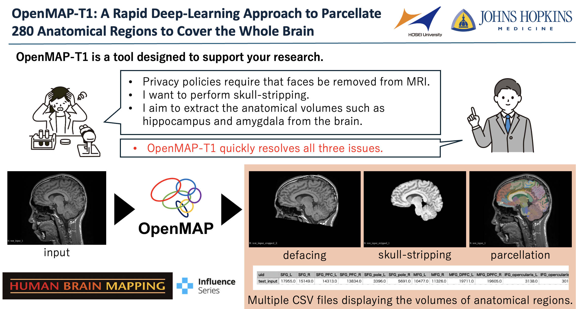
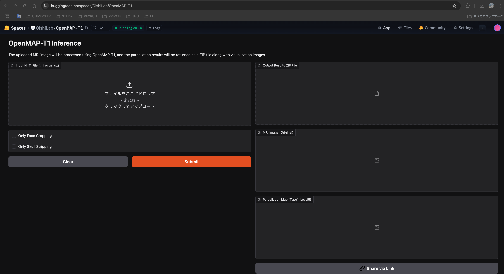
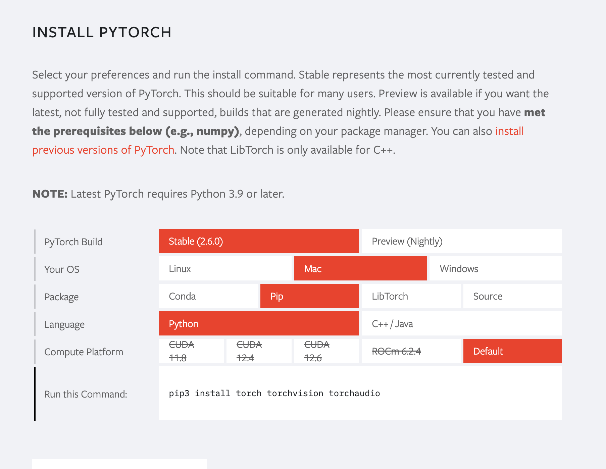
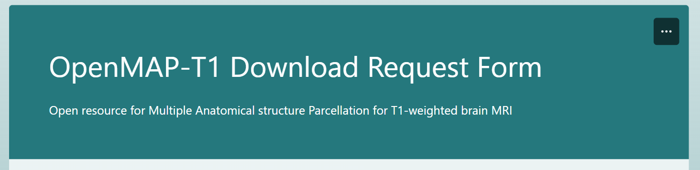
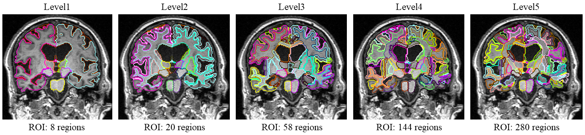

# OpenMAP-T1


**言語**: [English](../README.md) | [日本語 (Japanese)](README-ja.md)

[](https://www.medrxiv.org/content/10.1101/2024.01.18.24301494v1)
[](https://onlinelibrary.wiley.com/journal/10970193)
[](https://colab.research.google.com/drive/1fmfkxxZjChExnl5cHITYkNYgTu3MZ7Ql#scrollTo=xwZxyL5ewVNF)

[](https://huggingface.co/spaces/OishiLab/OpenMAP-T1)

**OpenMAP-T1: 全脳をカバーする280の解剖学的領域を分割するための高速深層学習アプローチ**<br>
**著者**: [Kei Nishimaki](https://researchmap.jp/knishimaki?lang=en), [Kengo Onda](https://researchmap.jp/kengoonda?lang=en), [Kumpei Ikuta](https://scholar.google.com/citations?user=Q9h-OP8AAAAJ&hl=ja), [Jill Chotiyanonta](https://www.researchgate.net/profile/Jill-Chotiyanonta), [Yuto Uchida](https://researchmap.jp/uchidayuto), [Susumu Mori](https://www.hopkinsmedicine.org/profiles/details/susumu-mori), [Hitoshi Iyatomi](https://iyatomi-lab.info/english-top), [Kenichi Oishi](https://www.hopkinsmedicine.org/profiles/details/kenichi-oishi)<br>

The Russell H. Morgan Department of Radiology and Radiological Science, The Johns Hopkins University School of Medicine, Baltimore, MD, USA <br>
Department of Applied Informatics, Graduate School of Science and Engineering, Hosei University, Tokyo, Japan <br>
The Richman Family Precision Medicine Center of Excellence in Alzheimer's Disease, Johns Hopkins University School of Medicine, Baltimore, MD, USA<br>

**概要**: *本研究では、従来の正規化によるアトラスベースのアプローチやマルチアトラスラベル融合（MALF）技術の限界を克服することを目的とした、T1強調脳MRIにおける迅速かつ正確な全脳パーセレーションのための深層学習ベースの手法であるOpenMAP-T1を紹介します。脳画像のパーセレーションは、特定の脳領域の詳細な分析を可能にするため、神経科学および臨床研究における基本的なプロセスです。このタスクには正規化によるアトラスベースの方法が採用されてきましたが、特に病的な状態における脳の形態の変化により限界に直面しています。MALF技術は画像のパーセレーション精度と脳形態の変化に対するロバスト性を向上させましたが、長い処理時間を要するという高い計算コストが犠牲となりました。OpenMAP-T1は、前処理、クロッピング、頭蓋除去（スカルストリッピング）、パーセレーション、半球セグメンテーション、そして最終的な統合という6つのフェーズにわたって複数の畳み込みニューラルネットワークモデルを統合しています。このプロセスには、MRI画像の標準化、脳組織の分離、そして詳細な灰白質および白質構造を含む全脳をカバーする280の解剖学的構造への分割が含まれます。同時に、パーセレーションプロセスを簡素化し、様々なスキャンタイプや条件に対応するための堅牢なトレーニングを取り入れています。OpenMAP-T1は、実世界の臨床画像を含む8つの利用可能なオープンリソースでテストされ、スキャナーの種類、磁場強度、および顔の匿名化（defacing）などの画像処理技術の違いがある様々なデータセットに対して堅牢性を示しました。既存の方法と比較して、OpenMAP-T1は精度を損なうことなく、画像あたりの処理時間を数時間から90秒未満へと大幅に短縮しました。特に、臨床現場で一般的に見られる強度の不均一性や頭部位置の変化がある画像の処理において効果的でした。OpenMAP-T1の幅広いMRIデータセットへの適応性と様々なスキャン条件への堅牢性は、ニューロイメージングにおける汎用的なツールとしての可能性を強調しています。*

論文: https://onlinelibrary.wiley.com/doi/full/10.1002/hbm.70063<br>
クラウドアプリケーション: https://huggingface.co/spaces/OishiLab/OpenMAP-T1<br>
**Human Brain Mapping** に掲載済み<br>

# Docker インストール手順
1. Dockerイメージのビルド

要約すると、このコマンドは `Dockerfile` と現在のディレクトリ内のファイルに基づいて "openmap-t1" という名前のDockerイメージを作成します。
```
docker build -t openmap-t1 .
```
* ```docker build```: このコマンドは `Dockerfile` に記載された指示に従ってDockerイメージをビルドします。
* ```-t openmap-t1```: -t フラグはイメージに "openmap-t1" という名前（タグ）を付けます。これにより後で参照しやすくなります。
* ```.```: ドットはビルドコンテキストを表し、Dockerが `Dockerfile` やその他の必要なファイルを現在のディレクトリで探すことを意味します。

2. Dockerコンテナの実行
```
docker run --rm -it -v "$(pwd):/app" openmap-t1 -i INPUT_FOLDER -o OUTPUT_FOLDER -m MODEL_FOLDER
```
* ```docker run```: Dockerイメージから新しいコンテナを開始します。
* ```--rm```: 実行が停止したときに自動的にコンテナを削除し、停止したコンテナを残さないようにしてシステムをクリーンに保ちます。

* ```-it```
2つのオプションを組み合わせています：
   * ```-i``` STDINを開いたままにします（インタラクティブモード）。
   * ```-t``` 疑似TTYを割り当てます（端末のような対話を可能にします）。

これらを合わせることで、必要に応じて端末を通じてコンテナと対話できるようになります。

* ```-v "$(pwd):/app"```: 現在の作業ディレクトリ（$(pwd)の結果）をコンテナ内の `/app` ディレクトリにマウントします。これは以下のことを意味します：
   * 現在のフォルダ内のすべてのファイルがコンテナ内の `/app` で利用可能になります。
   * コンテナ内で行われた変更（出力ファイルなど）はホストシステムに反映されます。

* ```openmap-t1```: コンテナの作成元となるDockerイメージの名前です。これは以前に ```docker build -t openmap-t1 .``` コマンドを使用してビルドされている必要があります。

* ```-i INPUT_FOLDER -o OUTPUT_FOLDER -m MODEL_FOLDER```
これらはコンテナ内で実行されるアプリケーションに渡されるコマンドライン引数です：
   * ```-i INPUT_FOLDER```: 入力フォルダのパスを指定します。
   * ```-o OUTPUT_FOLDER```: 出力フォルダのパスを指定します。
   * ```-m MODEL_FOLDER```: モデルフォルダのパスを指定します。
   ```INPUT_FOLDER```、```OUTPUT_FOLDER```、および ```MODEL_FOLDER``` を、マウントされた ```/app``` ディレクトリ内に存在する適切なディレクトリ名またはパスに置き換えてください。

# 標準インストール手順
**OpenMAP-T1は、JHUアトラスに基づいて全脳を280の解剖学的領域に50秒/症例で分割します。**

[](https://colab.research.google.com/drive/1fmfkxxZjChExnl5cHITYkNYgTu3MZ7Ql#scrollTo=xwZxyL5ewVNF)

0. Pythonのインストールと仮想環境の作成<br>
Python 3.9 以降が推奨されます。

1. このリポジトリをクローンし、リポジトリ内に移動します：
```
git clone https://github.com/OishiLab/OpenMAP-T1.git
cd OpenMAP-T1
```
3. 環境に合わせてPyTorchをインストールしてください。<br>
https://pytorch.org/

環境を選択すると、必要なコマンドが表示されます。



古いPytorch環境をインストールしたい場合は、以下のリンクからダウンロードできます。<br>
https://pytorch.org/get-started/previous-versions/

4.  PyTorch以外のライブラリをインストールします：
```
pip install -r requirements.txt
```
5. 以下のリンクから事前学習済みモデルを申請・ダウンロードし、サーバーにアップロードしてください。

6. OpenMAP-T1を実行できます！！

# 事前学習済みモデルのダウンロード方法
事前学習済みモデルはこのリンクから入手できます。
[事前学習済みモデルのリンク](https://forms.office.com/Pages/ResponsePage.aspx?id=OPSkn-axO0eAP4b4rt8N7Iz6VabmlEBIhG4j3FiMk75UQUxBMkVPTzlIQTQ1UEZJSFY1NURDNzRERC4u)



# すべてのコマンド
OpenMAP-T1の使用は簡単です。Linuxシステムの任意のターミナルで使用できます。CPUおよびGPUのサポートを提供しています。GPUでの実行ははるかに高速であり、常に推奨されます。以下はOpenMAP-T1の使用方法の最小限の例です。

## 基本的な使用法
ターミナルから以下のコマンドを実行します：
```
# Default
python3 src/parcellation.py -i INPUT_FOLDER -o OUTPUT_FOLDER -m MODEL_FOLDER
```
```
# Docker
docker run --rm -it -v "$(pwd):/app" openmap-t1 -i INPUT_FOLDER -o OUTPUT_FOLDER -m MODEL_FOLDER
```
* **-i INPUT_FOLDER**: 入力脳MRI画像が含まれるフォルダを指定します。
* **-o OUTPUT_FOLDER**: 結果が保存されるフォルダを定義します。このフォルダが存在しない場合は自動的に作成されます。
* **-m MODEL_FOLDER**: 処理用の事前学習済みモデルが含まれるフォルダを指定します。

## オプションの高速処理ステップ
OpenMAP-T1では、以下の排他的なフラグを使用して特定の処理ステップのみを実行できるようになりました。これらのオプションを指定することで、OpenMAP-T1は不要な処理ステップをスキップし、全体の処理時間を大幅に短縮できます。

* **顔のクロッピングのみ (Only Face Cropping)**: 顔のクロッピングのみを行い、残りの処理ステップをスキップしたい場合に使用します：
```
# Default
python3 parcellation.py -i INPUT_FOLDER -o OUTPUT_FOLDER -m MODEL_FOLDER --only-face-cropping
```
```
# Docker
docker run --rm -it -v "$(pwd):/app" openmap-t1 -i INPUT_FOLDER -o OUTPUT_FOLDER -m MODEL_FOLDER --only-face-cropping
```
* **頭蓋除去のみ (Only Skull Stripping)**: 頭蓋除去（スカルストリッピング）のみを行い、他のすべての処理ステップをスキップしたい場合は、スカルストリッピングフラグを使用します。スカルストリッピングには前提条件として顔のクロッピングが必要であるため、顔のクロッピングはスキップされる「他の処理」ステップには含まれないことに注意してください：
```
python3 parcellation.py -i INPUT_FOLDER -o OUTPUT_FOLDER -m MODEL_FOLDER --only-skull-stripping
```
```
# Docker
docker run --rm -it -v "$(pwd):/app" openmap-t1 -i INPUT_FOLDER -o OUTPUT_FOLDER -m MODEL_FOLDER --only-skull-stripping
```

## 特定のGPUの使用
特定のGPU（例：GPU 1）でスクリプトを実行したい場合は、コマンドの前に ```CUDA_VISIBLE_DEVICES=N``` を付けます。
```
CUDA_VISIBLE_DEVICES=1 python3 parcellation.py -i INPUT_FOLDER -o OUTPUT_FOLDER -m MODEL_FOLDER
```
Windowsユーザーでエラーが発生する場合は、 ```Python3``` を ```Python``` に変更してください。

# フォルダ構成
入力するすべての画像はNifTi形式で、拡張子が .nii である必要があります。
```
INPUR_FOLDER/
   ├ A.nii or .nii.gz
   ├ B.nii or .nii.gz
   ├ *.nii or .nii.gz

OUTPUT_FOLDER/
   ├── A
   │   ├── cropped
   │   │   ├── A_cropped_mask.nii
   │   │   └── A_cropped.nii
   │   ├── csv
   │   │   ├── A_Type1_Level1.csv
   │   │   ├── A_Type1_Level2.csv
   │   │   ├── A_Type1_Level3.csv
   │   │   ├── A_Type1_Level4.csv
   │   │   ├── A_Type1_Level5.csv
   │   │   ├── A_Type2_Level1.csv
   │   │   ├── A_Type2_Level2.csv
   │   │   ├── A_Type2_Level3.csv
   │   │   ├── A_Type2_Level4.csv
   │   │   └── A_Type2_Level5.csv
   │   ├── original
   │   │   ├── A_N4.nii
   │   │   └── A.nii
   │   ├── parcellated
   │   │   ├── A_Type1_Level1.nii
   │   │   ├── A_Type1_Level2.nii
   │   │   ├── A_Type1_Level3.nii
   │   │   ├── A_Type1_Level4.nii
   │   │   ├── A_Type1_Level5.nii
   │   │   ├── A_Type2_Level1.nii
   │   │   ├── A_Type2_Level2.nii
   │   │   ├── A_Type2_Level3.nii
   │   │   ├── A_Type2_Level4.nii
   │   │   └── A_Type2_Level5.nii
   │   └── stripped
   │       ├── A_stripped_mask.nii
   │       └── A_stripped.nii
   ├── ...

MODEL_FOLDER/
   ├ CNet/CNet.pth   
   ├ SSNet/SSNet.pth
   ├ PNet
   |   ├ coronal.pth
   |   ├ sagittal.pth
   |   └ axial.pth
   └ HNet/
      ├ coronal.pth
      └ axial.pth
```

# 補足情報

OpenMAP-T1は、脳全体を5つの階層的な構造レベルに分割します。最も粗いレベルは8つの構造からなり、最も細かいレベルは280の構造からなります。

* 追加の可視化と詳細な分析のために、[3D Slicer](https://www.slicer.org/) も利用できます。3D Slicerは、セグメンテーション、レジストレーション、3D可視化のための堅牢なツールを提供する、医療画像コンピューティングのための無料のオープンソースプラットフォームであり、OpenMAP-T1によって生成されたパーセレーションマップを探索するのに最適な選択肢です。

* 追加の可視化と詳細な分析のために、[ROIEditor](https://www.mristudio.org/installation.html) も優れたツールです。ROIEditorは、医療画像における関心領域（ROI）の作成と編集のために特別に設計された無料のオープンソースアプリケーションです。そのユーザーフレンドリーなインターフェースは正確なセグメンテーションと微調整を容易にし、OpenMAP-T1によって生成されたパーセレーションマップ上の特定の領域を分離して分析するのに理想的です。

# FAQ
* **OpenMAP-T1の貢献は何ですか？**<br>
GPUを使用する場合、OpenMAP-T1はT1強調画像をわずか1〜2分で処理します。CPUでも処理はおよそ30分で完了します。さらに、OpenMAP-T1は撮影環境の違いや脳萎縮に対して非常に高い堅牢性を持っています。

* **OpenMAP-T1ではどのアトラスが使用されていますか？**<br>
OpenMAP-T1はJHUアトラスを採用しています。

* **OpenMAP-T1は2D画像データで使用できますか？**<br>
論文には含まれていませんが、私たちの内部テストではOpenMAP-T1が2D画像でも機能することを示しています。ただし、2Dデータを使用すると一部の領域が失われる可能性があります。

* **OpenMAP-T1を実行するにはどれくらいのGPUメモリが必要ですか？**<br>
私たちはすべての実験を24 GBメモリを搭載したNVIDIA RTX3090 GPUで行いました。推論にはそれほど必要ありませんが、推論はCNNの完全畳み込みの性質を利用して実装されているため、必要なメモリ量は画像に依存します。典型的な画像であれば、4 GB未満のGPUメモリ消費で実行できるはずです。メモリ不足の問題が発生した場合は、以下を確認してください：1）データのボクセル間隔が正しいこと、2）MRI画像に頭部領域のみが含まれていること。

* **Type 1とType 2の違いは何ですか？**<br>
Type 1は脳の表面構造を皮質と皮質下白質に分離して出力します。通常、ほとんどの場合でType 1が使用されます。対照的に、Type 2は皮質と皮質下白質を単一のROIとして出力します。Type 2は、データ分析においてROIの数を最小限に抑えたい場合や、低解像度のPET画像を使用して局所脳血流量などのパラメータを定量化する場合に採用されることがあります。

* **トレーニングコードも提供されますか？**<br>
いいえ。トレーニングコードは公開できないデータと密接に関連しているためです。

# 引用
```
@techreport{nishimaki2024openmap,
  title={OpenMAP-T1: A Rapid Deep-Learning Approach to Parcellate 280 Anatomical Regions to Cover the Whole Brain},
  author={Nishimaki, Kei and Onda, Kengo and Ikuta, Kumpei and Chotiyanonta, Jill and Uchida, Yuto and Mori, Susumu and Iyatomi, Hitoshi and Oishi, Kenichi and Alzheimer's Disease Neuroimaging Initiative and Australian Imaging Biomarkers and Lifestyle Flagship Study of Ageing},
  year={2024},
  institution={Wiley Online Library}
}
```

# 関連研究
以下の研究では、T1強調MRIにおける高度なセグメンテーションと分析にOpenMAP-T1が利用されています。
* **[Change points for dynamic biomarkers in the Alzheimer's disease pathological cascade: A 30-year cohort study](https://alz-journals.onlinelibrary.wiley.com/doi/full/10.1002/alz.70544)**  
   *著者:* Yuto Uchida, Kei Nishimaki, Anja Soldan, Corinne Pettigrew, Sara Grace Ho, Abhay Moghekar, Mei-Cheng Wang, Michael I. Miller, Marilyn Albert, Kenichi Oishi;
   *ジャーナル:* Alzheimer's & dementia
* **[Acceleration of Brain Atrophy and Progression From Normal Cognition to Mild Cognitive Impairment](https://jamanetwork.com/journals/jamanetworkopen/fullarticle/2825474)**  
   *著者:* Yuto Uchida, MD, PhD; Kei Nishimaki; Anja Soldan, PhD; Abhay Moghekar, MBBS; Marilyn Albert, PhD; Kenichi Oishi, MD, PhD;  
   *ジャーナル:* JAMA Network Open
* **[A Neural Network Approach to Identify Left–Right Orientation of Anatomical Brain MRI](https://pmc.ncbi.nlm.nih.gov/articles/PMC11808181/)**  
   *著者:* Kei Nishimaki; Hitoshi Iyatomi, PhD; Kenichi Oishi, MD, PhD;  
   *ジャーナル:* Brain and Behavior

