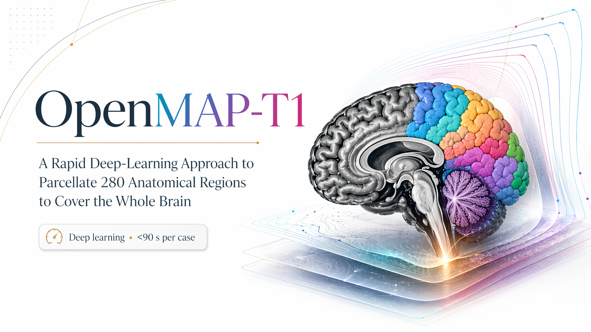
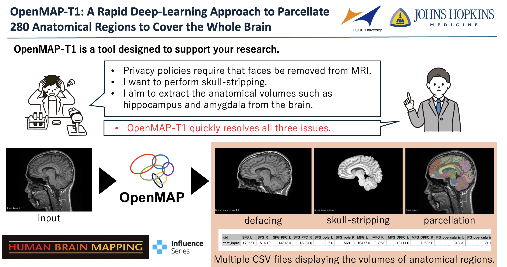
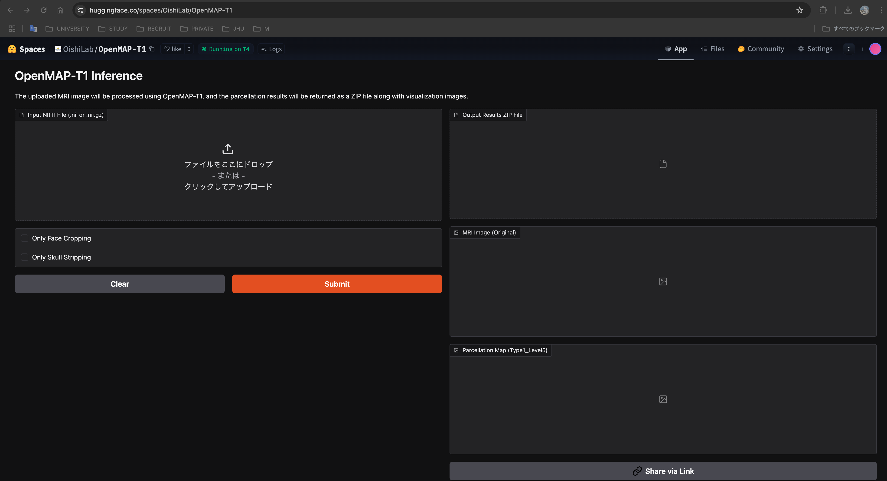
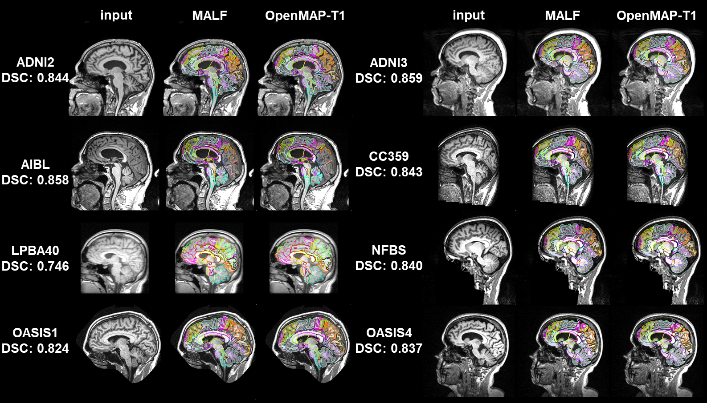
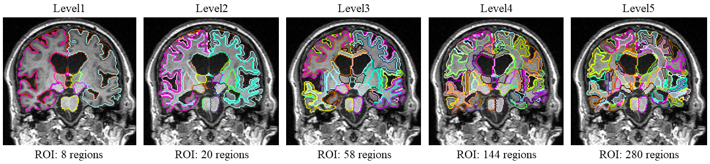

# OpenMAP-T1


**语言**: [English](../README.md) | [日本語 (Japanese)](README-ja.md) | [中文 (Chinese)](README-zh.md)

[](https://www.medrxiv.org/content/10.1101/2024.01.18.24301494v1)
[](https://onlinelibrary.wiley.com/journal/10970193)
[](https://colab.research.google.com/drive/1fmfkxxZjChExnl5cHITYkNYgTu3MZ7Ql#scrollTo=xwZxyL5ewVNF)

[](https://huggingface.co/spaces/OishiLab/OpenMAP-T1)

**OpenMAP-T1：一种快速深度学习全脑分区方法，可覆盖 280 个解剖区域**<br>
**作者**: [Kei Nishimaki](https://researchmap.jp/knishimaki?lang=en), [Kengo Onda](https://researchmap.jp/kengoonda?lang=en), [Kumpei Ikuta](https://scholar.google.com/citations?user=Q9h-OP8AAAAJ&hl=ja), [Jill Chotiyanonta](https://www.researchgate.net/profile/Jill-Chotiyanonta), [Yuto Uchida](https://researchmap.jp/uchidayuto), [Susumu Mori](https://www.hopkinsmedicine.org/profiles/details/susumu-mori), [Hitoshi Iyatomi](https://iyatomi-lab.info/english-top), [Kenichi Oishi](https://www.hopkinsmedicine.org/profiles/details/kenichi-oishi)<br>

**摘要（简要）**：OpenMAP-T1 面向 T1 加权脑 MRI，采用深度学习流程（预处理、裁剪、去颅骨、分区、半球分割与后处理）实现快速且稳健的全脑分区。该方法基于 JHU-atlas 体系，在多来源真实数据上验证，具备较强跨扫描条件的泛化能力，并显著缩短处理时间。<br>

论文: https://onlinelibrary.wiley.com/doi/full/10.1002/hbm.70063<br>
在线应用: https://huggingface.co/spaces/OishiLab/OpenMAP-T1<br>
注：更完整背景说明可参考英文版 README。<br>

# 安装
**OpenMAP-T1 基于 JHU-atlas，可在约 50 秒/例（GPU）内输出全脑 280 区分区结果。**

[](https://colab.research.google.com/drive/1fmfkxxZjChExnl5cHITYkNYgTu3MZ7Ql#scrollTo=xwZxyL5ewVNF)

## 使用 uv 安装（推荐）

[uv](https://github.com/astral-sh/uv) 是用 Rust 编写的高速 Python 依赖管理工具。

0. 安装 uv<br>
   **macOS / Linux:**
   ```bash
   curl -LsSf https://astral.sh/uv/install.sh | sh
   ```

   **Windows:**
   ```powershell
   powershell -c "irm https://astral.sh/uv/install.ps1 | iex"
   ```

   或使用 pip:
   ```bash
   pip install uv
   ```

1. 克隆仓库并进入目录:
```
git clone https://github.com/OishiLab/OpenMAP-T1.git
cd OpenMAP-T1
```

2. 安装依赖:
```
uv sync
```

3. 根据 README 中提供的链接申请并下载预训练模型后，放置到你的服务器目录。

## 使用 pip 安装（可选）

0. 建议使用 Python 3.9+ 并创建虚拟环境。<br>
1. 安装与你环境匹配的 PyTorch: https://pytorch.org/ <br>
2. 安装其他依赖:
```
pip install -r requirements.txt
```

# Docker 安装
1. 构建镜像
```
docker build -t openmap-t1 .
```

2. 运行容器
```
docker run --rm -it -v "$(pwd):/app" openmap-t1 -i INPUT_FOLDER -o OUTPUT_FOLDER -m MODEL_FOLDER
```

# 预训练模型下载
可通过以下链接申请下载：
[Link of pretrained model](https://forms.office.com/Pages/ResponsePage.aspx?id=OPSkn-axO0eAP4b4rt8N7Iz6VabmlEBIhG4j3FiMk75UQUxBMkVPTzlIQTQ1UEZJSFY1NURDNzRERC4u)


# 所有命令

## 基本用法
```
# uv
uv run python src/parcellation.py -i INPUT_FOLDER -o OUTPUT_FOLDER -m MODEL_FOLDER
```
```
# pip（先激活虚拟环境）
python3 src/parcellation.py -i INPUT_FOLDER -o OUTPUT_FOLDER -m MODEL_FOLDER
```
```
# Docker
docker run --rm -it -v "$(pwd):/app" openmap-t1 -i INPUT_FOLDER -o OUTPUT_FOLDER -m MODEL_FOLDER
```
```
# 可选：将输出保存为 .nii（默认输出为 .nii.gz）
python3 src/parcellation.py -i INPUT_FOLDER -o OUTPUT_FOLDER -m MODEL_FOLDER --output-ext .nii
```

- `-i INPUT_FOLDER`: 输入脑 MRI 所在目录
- `-o OUTPUT_FOLDER`: 输出目录（不存在会自动创建）
- `-m MODEL_FOLDER`: 预训练模型目录
- `--output-ext {.nii.gz, .nii}`: 输出 NIfTI 扩展名，默认 `.nii.gz`

## 可选加速流程
- 仅执行人脸裁剪:
```
python3 src/parcellation.py -i INPUT_FOLDER -o OUTPUT_FOLDER -m MODEL_FOLDER --only-face-cropping
```
- 仅执行去颅骨（包含必要的前置裁剪）:
```
python3 src/parcellation.py -i INPUT_FOLDER -o OUTPUT_FOLDER -m MODEL_FOLDER --only-skull-stripping
```

## 指定 GPU
```
CUDA_VISIBLE_DEVICES=1 python3 src/parcellation.py -i INPUT_FOLDER -o OUTPUT_FOLDER -m MODEL_FOLDER
```

# 文件夹结构
输入图像支持 `.nii` 与 `.nii.gz`。默认输出 NIfTI 为 `.nii.gz`（可用 `--output-ext .nii` 改为 `.nii`）。
```
INPUT_FOLDER/
   ├ A.nii or .nii.gz
   ├ B.nii or .nii.gz
   ├ *.nii or .nii.gz

OUTPUT_FOLDER/
   ├── A
   │   ├── cropped
   │   │   ├── A_cropped_mask.nii.gz
   │   │   └── A_cropped.nii.gz
   │   ├── csv
   │   │   ├── A_Type1_Level1.csv
   │   │   ├── A_Type1_Level2.csv
   │   │   ├── A_Type1_Level3.csv
   │   │   ├── A_Type1_Level4.csv
   │   │   ├── A_Type1_Level5.csv
   │   │   ├── A_Type2_Level1.csv
   │   │   ├── A_Type2_Level2.csv
   │   │   ├── A_Type2_Level3.csv
   │   │   ├── A_Type2_Level4.csv
   │   │   └── A_Type2_Level5.csv
   │   ├── original
   │   │   ├── A_N4.nii.gz
   │   │   └── A.nii.gz
   │   ├── parcellated
   │   │   ├── A_Type1_Level1.nii.gz
   │   │   ├── A_Type1_Level2.nii.gz
   │   │   ├── A_Type1_Level3.nii.gz
   │   │   ├── A_Type1_Level4.nii.gz
   │   │   ├── A_Type1_Level5.nii.gz
   │   │   ├── A_Type2_Level1.nii.gz
   │   │   ├── A_Type2_Level2.nii.gz
   │   │   ├── A_Type2_Level3.nii.gz
   │   │   ├── A_Type2_Level4.nii.gz
   │   │   └── A_Type2_Level5.nii.gz
   │   └── stripped
   │       ├── A_stripped_mask.nii.gz
   │       └── A_stripped.nii.gz
   ├── ...
```

## Level 元数据（JHU-Atlas）
`level/` 文件夹包含 OpenMAP-T1 使用的 JHU-atlas 分层定义与映射表。

- `level/OpenMAP-T1_multilevel_lookup_table_dictionary.csv` 记录了 **Type1 Level5** 的正式 ROI 名称及其多层级映射关系。
- Type1 文本字典命名为 `level/Type1Level1.txt` 到 `level/Type1Level5.txt`。

# 补充信息

OpenMAP-T1 将全脑划分为五级层次结构，最粗级别为 8 个结构，最细级别为 280 个结构。
